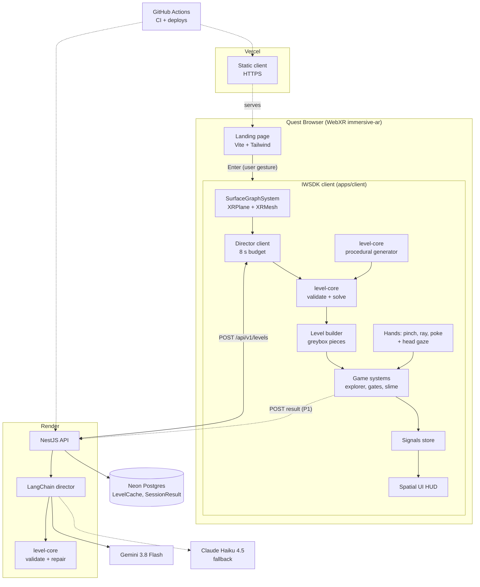
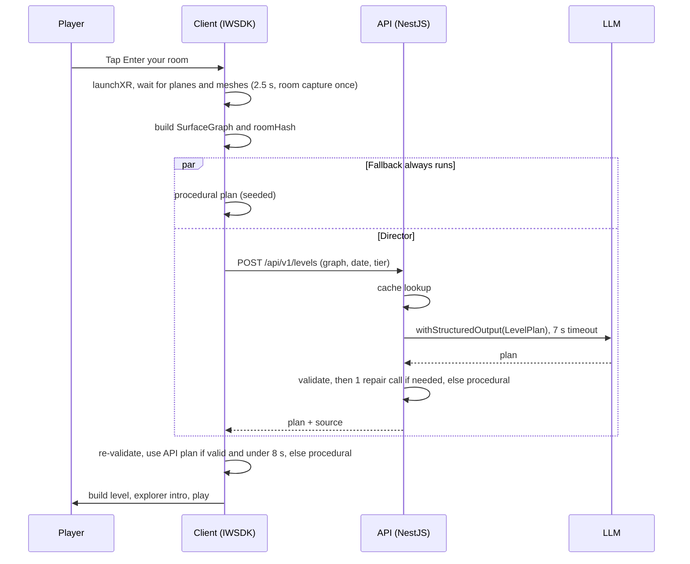

# Roomquest: Architecture and 2-Week Development Plan

**Prepared by:** Engineering Lead for Mina Narouz · v1.2, Sun Sep 27, 2026 · Companion: `PRD.md`\
**Build:** Mon Sep 28 → Sun Oct 11, 2026 (14 days: D1…D14). **Midpoint demo:** Sun Oct 4. **Feature freeze:** Thu Oct 8, 23:59 Cairo. **v1.0.0 to production:** Sun Oct 11.\
**Team:** 3d Developer (3D), Frontend Developer (FE), Backend Developer (BE), all AI agents; the Engineering Lead (Lead) owns decomposition, reviews, CI and production deploys. Mina is available **Sun–Thu, 06:00–08:00 Cairo** only (off Fri and Sat).\
**Merge rule:** PRs target `revision_branch`; ready to merge = **green CI + 1 approval**.

## Changelog v1.2 (Sep 27)
- **Prize targets:**
  - Primary target: **Best New Gaming Experience** ($100,000, 1 winner; runner-up $50,000; [overview](https://start-developer-competition-26.devpost.com/)).
  - Secondary targets: **Best Agentic Interaction**, **Boldest Original Concept** and **Best Reason to Come Back** (the daily seed), $25K each. Also in view: **Best First Five Minutes** ($25K).
  - The "Polish & Presentation" criterion explicitly covers UI/UX, art direction and sound design.
- **Post-MVP priorities for Oct 12 – Nov 8, in order:** (1) polish (custom art for the 10 pieces and the explorer, sound design and music, hand-interaction juice); (2) the first five minutes (onboarding, fast cold start, the room-reveal moment); (3) the "adapt" agent; (4) extra pieces, only if 1–3 are done. The feature freeze stays **Nov 8**.
- **Headset:** buying a **Quest 3S** is now the recommended plan. Mina decides and orders by **Wed Sep 30** so it arrives before the Oct 8 device test. Borrowing is the backup. Risks, the day plan, Mina's tasks and the budget are updated to match.

## Changelog v1.1 (Sep 27)
All team-approved; MVP scope for Oct 11 is unchanged.
- **X-01:** the spike also checks DistanceGrabbable axis locking (for X-07), fixed-foveation exposure (for X-10) and emulator support for persistent anchors (for X-09); findings go in `docs/emulator-rooms.md`. **X-05** may start path-following against fixtures on D4 if X-02 finishes early.
- **F-01:** the desktop unsupported message keeps the "Try in emulator" link. With `?emulator=1` the capability check runs after the emulator loads. "Enter your room" stays disabled until the prefetched XR chunk has loaded. **F-06** builds against a stub explorer until X-05 lands.
- **F-02:** the store emits typed, timestamped `explorerBlocked` and time-per-beat (`beatCompleted`) events, a hook for adapt.
- **B-06:** a small custom limiter in the levels service handles the cache-miss budget, and the per-IP throttler guard stays. Every cache hit is re-validated with `level-core.validate` against the incoming graph; a failure counts as a miss (roomHash only covers the 6 largest surfaces).
- **B-05:** `LevelPlanLLM` avoids tuples, regex and unions (Gemini structured-output limits). The prompt, model setup and repair loop are reusable modules. `level-core` stays browser-safe (no `node:crypto` or other `node:*` imports).
- **Post-MVP:** the "adapt" agent becomes **stretch priority #1 for Oct 19 – Nov 8**, as `POST /api/v1/levels/:cacheKey/adapt`, aimed at the Best Agentic Interaction award.

---

## 1. Key decisions (read this first)

1. **One Vite + IWSDK app, not Next.js.** The landing page and the XR game are one Vite multi-entry app (`apps/client`). Reasons:
   - IWSDK's official scaffold and dev plugins are Vite plugins (`@iwsdk/vite-plugin-dev`, `@iwsdk/vite-plugin-iwer` peer on `vite ^7`).
   - WebXR sessions must start from a user gesture on the same page, so a Next.js page wrapping a client-only XR island would add hydration, a second build system and a framework runtime for no benefit. There's no SSR, SEO-critical content or server route that we need.
   - The landing chunk stays tiny (vanilla TS + Tailwind 4); the XR bundle is prefetched after first paint and imported when "Enter your room" is pressed, so nothing from the landing page runs during the XR frame loop.
   - The FE keeps TypeScript, Tailwind and Zod, just without Next.js.
2. **Hosting:** the client goes on **Vercel (Hobby)**, one of the two IWSDK hosting options the competition resources page names. The API runs on **Render** (a Node web service from a `render.yaml` blueprint) with Postgres on **Neon Free**.
   - Render is git-driven with no Docker needed, has deploy hooks, rollbacks and health checks, and costs nothing during the sprint.
   - Render's free Postgres expires after 30 days ([render.com/docs/free](https://render.com/docs/free)), so the database lives on Neon, whose Free plan is permanent with no card ([neon.com/pricing](https://neon.com/pricing)).
   - Render free instances sleep after 15 min idle and take about 1 min to wake ([render.com/docs/free](https://render.com/docs/free)). The **prod API moves to Render Starter ($7/mo, [render.com/pricing](https://render.com/pricing)) before Nov 1** and stays there through the Dec 11 winner announcement. The game never needs the API to be awake (procedural fallback).
3. **LLM:** primary is **Google Gemini `gemini-3.8-flash`** via `@langchain/google-genai`. It's GA, supports structured outputs and is priced at $0.75/$3.75 per 1M tokens through Dec 31, 2026 ([ai.google.dev](https://ai.google.dev/gemini-api/docs/latest-model)), so ~2k in / 600 out ≈ **$0.004 per level**. Fallback is **Anthropic `claude-haiku-4-5`** via `@langchain/anthropic` ([docs](https://platform.claude.com/docs/en/models/haiku-4-5/overview)), which covers a provider outage. Its retirement is "not sooner than Oct 15, 2026", so the model id is an env var; swap it to `claude-sonnet-5` if Haiku 4.5 is retired. If Gemini p95 latency exceeds 6 s in the eval, `DIRECTOR_MODEL` switches to `gemini-3.5-flash-lite` (low-latency GA model).
4. **The validator, solvability check and procedural generator are shared code** (`packages/level-core`). The API uses them to verify and repair LLM output; the client uses the same code to re-verify and to run the fallback generator in parallel. Consequence: the game is fully playable with the API down (the "take it away" test).
5. **Scope for 2 weeks:** the 10 ★ pieces, the core loop and the AI director with cache. The following are **cut to post-MVP**:
   - the "adapt" stuck-player agent (post-MVP priority #3, see §10 "After Oct 11")
   - the other 11 pieces
   - two-hand rope stretching
   - the wrist menu
   - tabletop hit-test mode
   - hand-modelled GLB art and music
   - Village anchor persistence is P1: in if merged by the freeze, otherwise post-MVP.
6. **Honest feasibility call:** the 10-piece MVP fits only because three agents work in parallel from D1 against a shared schema and a mocked API. Nothing guarantees ≥ 60 fps on a real Quest until someone runs it on one. The **biggest risk is having no headset**: we mitigate it by buying a Quest 3S (decision by Sep 30, borrowing as the backup). The other big risk is Start-membership approval. If we're behind at the Oct 4 demo, cut in this order: `portal` → `moving_platform` → `slime` → `ramp`. The core then keeps 6 pieces (hut, shrine, plank, gate, lever, gem).

## 2. Tech stack (pinned majors)

| Layer | Choice (pin) | Why |
|---|---|---|
| Language | **TypeScript 5.9** (`~5.9.3`), `strict: true` | One language across client, API and shared packages; typescript-eslint supports `<6.1`; Nest needs `emitDecoratorMetadata`, which TS 7's native compiler isn't proven with yet. |
| Runtime | **Node.js 22 LTS** (`.nvmrc` `22`, ≥ 22.12) | Meets IWSDK (`>=22.12 <23`), Vite 7, Prisma 7 and ESLint 9 engine ranges; LTS through Apr 2027 covers judging. The competition suggests Node ≥ 20.19. |
| Monorepo | **pnpm 10** workspaces + **Turborepo 2** | Fast installs, strict deps, cached `build/lint/test` graph; Vercel and Render both support pnpm. |
| Shared package build | **tsup 8** (ESM + CJS + `.d.ts`) | Vite consumes ESM, Nest 11 runs CJS; one tiny build step for `schema` and `level-core`. |
| XR framework | **IWSDK `@iwsdk/core` 1.0.0-rc.2 (exact pin)** | The design doc's choice; ECS + WebXR AR, scene understanding (`XRPlane`, `XRMesh`, `XRAnchor`), `OneHandGrabbable`/`DistanceGrabbable`/`RayInteractable`/`PokeInteractable`, `GazeSystem`, spatial UI, IWER emulator with the 5 scanned rooms. Exact pin because it's a release candidate. |
| 3D engine | **Three.js as bundled by IWSDK** (`super-three@0.181`, no separate `three` dependency) | Avoids two copies of Three.js and type conflicts; IWSDK re-exports what we need. |
| Physics | **None for gameplay**; IWSDK's bundled Havok (`@babylonjs/havok` 1.x) **off** in MVP | Snapping, explorer walking and platform rails are deterministic kinematics (cheaper, no jitter, 60 fps safe). Havok can be enabled later for dropped-piece or confetti flair. |
| Spatial UI | **IWSDK spatialUI** (`@pmndrs/uikit` / UIKitML, bundled) | In-headset panels without DOM overlays; supports poke and ray. |
| State | **`@preact/signals-core` 1.x** (already an IWSDK dependency) | Tiny reactive store shared by the HUD and ECS systems; no extra framework. |
| Landing / 2D shell | **Vanilla TS + Tailwind CSS 4** (`@tailwindcss/vite`) inside the same Vite app | Landing JS < 50 KB gz; FE's preferred styling; no React or Next runtime in the XR page. |
| Bundler / dev server | **Vite 7** (whatever `npm create @iwsdk@1.0.0-rc.2` scaffolds; IWSDK plugins require `^7`) | Official IWSDK toolchain, HTTPS dev server, emulator injection. |
| Backend | **NestJS 11** (`@nestjs/*` 11.x) on Express | BE's comfort zone and the design doc's choice. Nest 12 is days old and ecosystem packages (e.g. `nestjs-zod`) still peer on ≤ 11. |
| AI orchestration | **LangChain JS 1.x** (`langchain` 1.x, `@langchain/core` 1.x, `@langchain/google-genai` 2.x, `@langchain/anthropic` 1.x) | `withStructuredOutput(zodSchema)` gives typed plans; provider swap is one line; `FakeListChatModel` for tests. |
| LLM | **`gemini-3.8-flash`** (primary), **`claude-haiku-4-5`** (fallback), both env-configurable | See §1.3: fast, cheap, structured output; cross-provider fallback. |
| Schema / validation | **zod 4** (`^4`) | One source of truth for `SurfaceGraph`, `LevelPlan` and API DTOs; supported by `@langchain/core` (`^3.25.76 \|\| ^4`). |
| ORM / DB | **Prisma 7** (`prisma@7`, `@prisma/client@7`, Neon driver adapter) + **Postgres 17 on Neon** | BE's comfort zone and the design doc's choice. Prisma 8 is still RC; 7 is the latest stable major. |
| API extras | `@nestjs/config` + zod env schema, `@nestjs/throttler` (per-IP guard) + a small custom per-device cache-miss limiter in the levels service, `helmet`, `nestjs-pino` | Validated config, rate limits, security headers, structured logs. |
| Unit tests | **Vitest 4** (all packages and the client), **Jest-free Nest tests via Vitest + `@nestjs/testing` + supertest** | One test runner everywhere; Vitest 4 supports Vite 7. |
| E2E | **Playwright 1.x** (Chromium, IWER emulator, `?director=mock`) | Landing + emulated-session smoke test in CI (non-blocking until stable). |
| Lint / format | **ESLint 9** (flat config) + **typescript-eslint 8** + **Prettier 3** | Standard, supported combo; `eslint-config-prettier` avoids rule fights. |
| CI | **GitHub Actions** (`ci.yml`, `deploy-staging.yml`, `deploy-prod.yml`, `eval.yml`, `pages.yml`) | Free for public repos; required checks gate merges. |
| Frontend hosting | **Vercel Hobby**: HTTPS, PR preview URLs, prod via CLI from a tag | Named on the competition resources page for IWSDK; free; previews are HTTPS so WebXR works on any PR build. |
| API hosting | **Render** web service (Oregon), free for staging, **Starter $7/mo for prod from Nov 1** | Blueprint IaC, deploy hooks, health checks, instant rollback. |
| DB hosting | **Neon Free** (AWS us-west-2), branches `main` (prod) and `staging` | Permanent free tier, scale-to-zero, branching for staging. |
| Mirror | **GitHub Pages** (static build of the client) | Covers the rules' "GitHub page" wording; free on public repos. |

## 3. System diagram



**Runtime sequence (one session):**



## 4. Repository layout

```
roomquest/
├─ apps/
│  ├─ client/                      # Vite 7 + IWSDK app → Vercel (FE + 3D)
│  │  ├─ index.html                # landing page (FE)
│  │  ├─ vite.config.ts            # IWSDK dev/iwer plugins, Tailwind, base path per target
│  │  ├─ public/assets/            # audio (CC0), icons; LICENSES.md
│  │  └─ src/
│  │     ├─ landing/               # FE: landing UI, capability check, prefetch XR chunk
│  │     ├─ game/                  # FE: signals store, session state machine, director client, stars
│  │     ├─ ui/                    # FE: UIKitML panels (dialogue, beat, pause, win, no-surfaces)
│  │     ├─ debug/                 # FE: ?debug=1 overlay, URL flags, window.__rq hooks
│  │     ├─ audio/                 # FE: audio manager
│  │     └─ xr/                    # 3D
│  │        ├─ boot.ts             # World.create + launchXR
│  │        ├─ systems/            # SurfaceGraphSystem, LevelBuilderSystem, ExplorerSystem,
│  │        │                      # PlacementSystem, GateLeverSystem, PlatformSystem, SlimeSystem, PortalSystem
│  │        ├─ pieces/             # greybox geometry factories, one file per piece
│  │        └─ adapters/           # thin wrappers over IWSDK APIs (rc-safety)
│  └─ api/                         # NestJS 11 → Render (BE)
│     ├─ src/
│     │  ├─ main.ts, app.module.ts
│     │  ├─ config/                # zod-validated env
│     │  ├─ health/                # GET /api/health
│     │  ├─ levels/                # controller, service, cache repo, DTO pipes
│     │  ├─ director/              # LangChain chain, prompts/, providers, repair loop
│     │  └─ results/               # POST result (P1)
│     ├─ prisma/schema.prisma      # LevelCache, SessionResult
│     ├─ prisma.config.ts
│     ├─ eval/                     # LLM eval harness → docs/eval/*.md
│     └─ test/                     # supertest contract tests
├─ packages/
│  ├─ schema/                      # @roomquest/schema: zod SurfaceGraph, LevelPlan, LevelPlanLLM,
│  │                               # API DTOs, PIECE_IDS, KIT_CATALOG constants   ← SHARED BY CLIENT + API
│  ├─ level-core/                  # @roomquest/level-core: validator, BFS solvability, auto-repair,
│  │                               # procedural generator, seeded PRNG, dialogue templates (pure TS,
│  │                               # browser-safe: no node:* imports)
│  └─ fixtures/                    # @roomquest/fixtures: surface graphs for 5 emulator rooms +
│                                  # synthetic; golden and pre-generated plans
├─ docs/                           # PRD.md, ARCHITECTURE-AND-PLAN.md, api.md, emulator-rooms.md,
│                                  # device-test.md, eval/, release-checklist.md
├─ .github/
│  ├─ workflows/ ci.yml deploy-staging.yml deploy-prod.yml eval.yml pages.yml
│  └─ pull_request_template.md     # includes rules-compliance checklist
├─ render.yaml                     # roomquest-api-staging, roomquest-api-prod
├─ vercel.json                     # build + output for apps/client, headers
├─ turbo.json  pnpm-workspace.yaml  package.json  tsconfig.base.json
├─ eslint.config.js  .prettierrc  .nvmrc  .env.example
└─ README.md
```

**Shared schema location:** `packages/schema` (`@roomquest/schema`), a workspace dependency of `apps/client`, `apps/api` and `packages/level-core`. Nobody redefines these types anywhere else.

## 5. Shared data contracts (`@roomquest/schema`)

```ts
// MVP piece set (design doc ★). Post-MVP ids are added later without breaking v1 plans.
export const PIECE_IDS = ["village_hut","crystal_shrine","plank_bridge","ramp","moving_platform",
  "gate","lever","gem","slime","portal"] as const;
export const SurfaceLabel = z.enum(["table","desk","couch","bed","shelf","storage","floor","seat_like","other"]);
export const Vec3 = z.tuple([z.number(), z.number(), z.number()]);

export const SurfaceNode = z.object({
  id: z.string().regex(/^s\d{1,2}$/),        // "s1".."s12"
  label: SurfaceLabel, kind: z.enum(["plane","mesh","merged"]),
  topHeight: z.number().min(0).max(1.8),       // m above floor
  centroid: Vec3,                               // m, local-floor space, cm-rounded
  size: z.tuple([z.number(), z.number()]),      // top face width x depth (m)
  yaw: z.number(),                              // radians, orientation of the top face
  area: z.number().min(0.04),                   // m²
  reach: z.enum(["hand","ray","outOfView"]),
  angleFromForward: z.number().min(0).max(180), // degrees, from the seated start pose
});
export const SurfaceEdge = z.object({
  a: z.string(), b: z.string(), gap: z.number().min(0), dh: z.number(),
  kind: z.enum(["adjacent","plank","ramp","rope","portalOnly"]),
});
export const SurfaceGraph = z.object({
  version: z.literal(1), roomHash: z.string().length(12), mode: z.enum(["scene","tabletop"]),
  floorY: z.number(), nodes: z.array(SurfaceNode).min(2).max(12), edges: z.array(SurfaceEdge).max(66),
});

// LevelPlan = design doc §6 with PIECE_IDS above (Placement: id, piece, surface, to?, u, v, playerBuilt, links;
// LevelPlan: seed, theme, title, start, goal, placements[4..14], beats[2..4], dialogue[..12]).
// LevelPlanLLM = the same shape with no .default()/.transform(), all fields required, and no tuples, regex or unions
// (Gemini structured-output limits; provider JSON-schema safe);
// parse the LLM output with LevelPlanLLM, then LevelPlan.parse() to normalise.
export const Tier = z.enum(["easy","normal"]);
export const PlanSource = z.enum(["cache","llm","llm_repaired","procedural"]);
```

## 6. API contract (client ↔ director)

Base URL: `VITE_API_BASE_URL` (prod `https://roomquest-api.onrender.com`, staging `https://roomquest-api-staging.onrender.com`; the exact hostnames are assigned by Render on creation). JSON only, request body ≤ 16 KB, CORS allowlist = prod Vercel domain, GitHub Pages mirror origin, this project's Vercel preview domains (regex), `https://localhost:*`.

| Method & path | Request | Success response | Errors |
|---|---|---|---|
| `GET /api/health` | none | `200 {status:"ok", version:"<git sha>", db:"ok"\|"down", llm:"configured"\|"missing", time}` | none (always 200 if the process is up) |
| `POST /api/v1/levels` | Headers: `X-Device-Id: <uuid v4>`, `X-Client-Version: <semver>`. Body `LevelRequest = {graph: SurfaceGraph, date: "YYYY-MM-DD", tier: Tier, recentThemes?: Theme[] (max 3)}` | `200 LevelResponse = {plan: LevelPlan, source: PlanSource, cacheKey: string, model?: string, promptVersion: string, latencyMs: number, repairs: string[]}` | `400 {error:{code:"INVALID_REQUEST", message, issues: ZodIssue[]}}` · `429 {error:{code:"RATE_LIMITED", retryAfterS}}` · `500 {error:{code:"INTERNAL"}}` |
| `POST /api/v1/levels/:cacheKey/result` (P1) | Header `X-Device-Id`. Body `{stars: 0..3, gems: 0..5, timeMs: int, completed: boolean, planSource: PlanSource}` | `204` | `400`, `404 {code:"UNKNOWN_LEVEL"}`, `429` |
| `POST /api/v1/levels/:cacheKey/adapt` (**post-MVP priority #3, Oct 12 – Nov 8**) | Header `X-Device-Id`. Body `{graph: SurfaceGraph, plan: LevelPlan, stuck: {beatIndex, blockedReason, stuckMs, recentEvents[]}}` (from the F-02 `explorerBlocked` / time-per-beat events) | `200 {patch: {say?: string (≤ 90 chars), add?: Placement, move?: {placementId, u, v}}, source: "llm"\|"canned"}`, at most one piece added or moved | `400`, `404`, `429`; the client runs `level-core.validate` on plan + patch before applying and ignores invalid patches |

**Server semantics for `POST /levels`:**
1. Validate the body with zod (400 on failure).
2. `seed = roomHash + "-" + date`; `cacheKey = sha256(roomHash|date|tier|promptVersion).slice(0,16)`.
3. On a cache hit, re-run `level-core.validate` on the cached plan against the incoming graph (roomHash only covers the 6 largest surfaces). If valid, return `source:"cache"`; if not, treat it as a miss.
4. On a miss: LLM `withStructuredOutput(LevelPlanLLM)` with a 7 s total budget → `level-core.validate` → if invalid, one repair call with the issue list → if still invalid or out of time, `level-core.generate(graph, seed, tier)` with `source:"procedural"`.
5. Persist every non-cache result.
6. **The API never returns 5xx for LLM problems.** It degrades to the procedural plan with 200.
7. Rate limits: cache misses 10/hour per `X-Device-Id` (small custom limiter in the levels service); 60/hour per IP (`@nestjs/throttler` guard); cache hits don't count against the per-device budget.

**Client semantics:** start the generator and the POST together. Accept the API plan only if it arrives in ≤ 8 s and passes `level-core.validate` against the local graph; otherwise use the local procedural plan. Log the chosen `source` to the debug overlay.

## 7. Component notes

- **SurfaceGraphSystem (3D):** queries `XRPlane` and `XRMesh` entities and applies design doc §5 steps 1–7. `roomHash` = first 12 hex chars of the SHA-256 of the sorted `(label, topHeight rounded to 5 cm, area rounded to 0.1 m²)` of the 6 largest surfaces, so it stays stable across sessions and scan noise. If no planes arrive in 2.5 s it calls `session.initiateRoomCapture()` **once**, before creating any anchor. With < 2 usable surfaces it emits `noSurfaces`.
- **Level builder (3D):** maps `(surface, u, v)` to a world pose (u along width, v along depth of the top face, 3 cm inset from edges). Pieces are greybox factories built from merged low-poly geometry with vertex colours in a 4-theme palette; gems and planks are instanced.
- **Explorer (3D):** kinematic, 0.15 m/s, follows the BFS path from `level-core` over surfaces plus built links. States: `idle, walking, blocked(reason), riding, teleporting, celebrating`.
- **Placement (3D):** tray pieces use `OneHandGrabbable`. Snap targets are the plan's `playerBuilt` placements. The ghost shows within 10 cm; release snaps or returns the piece to the tray.
- **Game store (FE):** phases `landing → requesting → surveying → building → playing ⇄ paused → won | noSurfaces | error`. Typed, timestamped events: `pieceBuilt`, `gateOpened`, `slimeStunned`, `gemCollected`, `explorerBlocked`, `beatCompleted` (time per beat), `explorerOutOfView`, `won`. Stars: 3 if time ≤ par and gems ≥ 3; 2 if either; else 1.
- **Director (BE):** static system prefix (role, rules, full `KIT_CATALOG` with constraints, 2 few-shot plans), so provider prompt caching applies. The user message is only `{graph, seed, tier, recentThemes}`. Temperature 0.7. `PROMPT_VERSION` constant is part of the cache key.
- **Perf budget (3D + FE):** < 100 draw calls, < 200k triangles, 1 directional + ambient light, no real-time shadows (blob decals), no transparency except UI, `?debug=1` overlay reading `renderer.info`.

## 8. Environments, CI and deployment

| Env | Client | API | DB | Trigger |
|---|---|---|---|---|
| Local | `pnpm dev` (Vite HTTPS + IWER emulator, `living_room` default) | `pnpm --filter api dev` (`DIRECTOR_MODE=mock` default) | local Docker Postgres 17 or a Neon dev branch | none |
| PR preview | Vercel preview URL per PR (Git integration) → staging API | none | none | every PR push |
| Staging | Vercel preview for `revision_branch` (stable branch URL) | Render `roomquest-api-staging` (free) | Neon branch `staging` | merge to `revision_branch` (`deploy-staging.yml`) |
| Production | Vercel production (`roomquest.vercel.app` if available) + GitHub Pages mirror | Render `roomquest-api-prod` (free → Starter before Nov 1) | Neon branch `main` | git tag `v*` pushed by the Lead (`deploy-prod.yml`) |

**Workflows:**
- `ci.yml` (on PR to `revision_branch` and on push): jobs `lint`, `typecheck`, `test` (Vitest + coverage), `build` (turbo, cached). These four are the **required checks**. `e2e` (Playwright smoke) runs but is non-blocking until the Lead promotes it (target Oct 7).
- `deploy-staging.yml` (push to `revision_branch`): `prisma migrate deploy` (staging `DIRECT_URL`) → trigger the Render staging deploy hook → wait for `/api/health` to report the new `version`.
- `deploy-prod.yml` (tag `v*`, GitHub Environment `production`):
  1. CI must be green on the tagged commit.
  2. `prisma migrate deploy` (prod).
  3. Render prod deploy hook, then poll `/api/health` until `version == tag sha`.
  4. `vercel pull --environment=production && vercel build --prod && vercel deploy --prebuilt --prod`.
  5. Smoke: `curl` landing 200, `/api/health` 200, one `POST /levels` with the `living_room` fixture returns a valid plan.
  6. On failure: `vercel rollback` + Render "Rollback to previous deploy" (documented in `docs/release-checklist.md`).
- `pages.yml` (tag `v*`): build the client with `base: "/roomquest/"` and the prod API URL, deploy to GitHub Pages.
- `eval.yml` (manual `workflow_dispatch`): runs the LLM eval with the `GOOGLE_API_KEY` secret and uploads the report.

**Vercel settings:** framework "Vite", root `apps/client`, install `pnpm install --frozen-lockfile`, build `pnpm turbo run build --filter=client`, output `apps/client/dist`. **Production Branch set to `release`**, a branch that is never pushed, so merges never auto-deploy production; prod ships only from tags via CLI. **Disable Vercel Authentication for Preview deployments** so a headset can open preview and staging URLs without a Vercel login. Env `VITE_API_BASE_URL` per environment.

**Branch and PR conventions:** branches `feat/<ticket>-<slug>` / `fix/<ticket>-<slug>`; Conventional Commits; squash merge; one ticket = one PR; PR body links the ticket id, includes screenshots or emulator GIFs for visual work, and ticks the compliance checklist (no controller path, no palm-facing pinch, no logos or brands, assets licensed, perf overlay numbers for XR changes).

## 9. Reviews and identities

GitHub never lets a PR author approve their own PR. If all agents act as Mina's account, the "1 approval" rule deadlocks. Setup:
- **Dev agents (3D, FE, BE) and the Lead's own PRs** push branches and open PRs as the machine account **`roomquest-bot`** (a collaborator with *Write*).
- **The Lead reviews and approves as Mina's account** (Mina can also approve any PR herself in her window).
- The Lead merges after green CI + approval (auto-merge enabled). Admin bypass is off, so production quality gates apply to everyone.

## 10. Day-by-day plan (Mon Sep 28 → Sun Oct 11)

Mina's window = 06:00–08:00 Cairo, Sun–Thu. ★ = milestone. Ticket ids refer to §11.

| Day | Date | Mina (06:00–08:00 Cairo) | Lead | 3d Developer | Frontend Developer | Backend Developer | Integration / milestone |
|---|---|---|---|---|---|---|---|
| D1 | Mon Sep 28 | **M-01 apply to Start**, M-02 Devpost, M-03 repo, M-04 bot account, M-05 Quest 3S research + backup borrow asks, M-06 hosting accounts, M-07 LLM keys | L-01 scaffold (merge by 12:00), L-02 CI | X-01 IWSDK AR spike | F-01 landing + Enter flow (start) | B-01 shared schema | ★ Repo live, CI green on scaffold |
| D2 | Tue Sep 29 | M-08 secrets, M-09 required checks, M-10 connect Vercel + Render + Neon, answer open questions | L-03 staging pipeline (start), reviews | X-02 SurfaceGraphSystem (start) | F-01 finish; F-02 store + state machine (start) | B-02 API skeleton + mock director; B-10 render.yaml + Prisma/Neon config | **IP1:** schema merged; mock `/levels` runs locally |
| D3 | Wed Sep 30 | **M-11b decide on and order the Quest 3S**; M-11 review landing copy/look (15 min); check Start status | L-03 finish: staging auto-deploys | X-02 finish + 5-room fixtures | F-02 finish; F-03 director client (start) | B-03 validator + solvability | ★ Staging URL live (landing + mock API) |
| D4 | Thu Oct 1 | M-12 try staging in desktop emulator (20 min); confirm the Quest 3S delivery date (if it won't arrive by Oct 7, activate the backup lender) | reviews; L-05 midpoint demo script | X-03 level builder + greybox kit | F-03 finish; F-04 HUD panels (start) | B-04 auto-repair + procedural generator | **IP2:** generator merged → client builds a procedural level in `living_room` |
| D5 | Fri Oct 2 | (off) | L-04 prod env + deploy-prod workflow | X-04 plank/ramp pinch-snap | F-05 debug/perf overlay + URL flags | B-05 LangChain director (Gemini + fallback) | |
| D6 | Sat Oct 3 | (off) | integration test pass on staging; demo dry-run | X-05 explorer walker | F-04 finish; F-06 onboarding + gaze hint + edge arrow (start) | B-06 Prisma cache + daily seed + rate limit | **IP3:** real director + cache on staging |
| D7 | Sun Oct 4 | **★ M-13 midpoint demo (45 min) + cut decision**; check Start | runs demo; records decisions; re-plans | X-06 gate + lever | F-06 finish | B-07 LLM eval harness + first report | ★ **Midpoint demo:** director → level → pinch plank → explorer walks → win (emulator, staging) |
| D8 | Mon Oct 5 | M-14 open prod URL (v0.1.0 dry run) on phone + desktop (10 min) | L-04 prod dry-run tag `v0.1.0` | X-07 moving platform + portal | F-07 win flow, stars, pause wiring | B-08 prompt tuning + pre-generated plans | ★ Prod pipeline proven |
| D9 | Tue Oct 6 | M-15 if the Quest is in hand: update OS, run Space Setup in 2 rooms (20 min) | L-06 release checklist + compliance | X-08 slime | F-08 audio + CC0 SFX; F-10 no-surface/error UX | B-09 results endpoint + hardening | all 10 pieces merged by end of day |
| D10 | Wed Oct 7 | M-16 skim Devpost text draft (15 min) | L-07 device-test protocol; L-09 Pages mirror; promote e2e to required | X-10 perf pass; X-09 anchor (P1) | F-09 Playwright smoke + `autoSolve` hook | B-11 bugfix / eval re-run | `v0.9.0-rc.1` → prod for the device test |
| D11 | Thu Oct 8 | **★ M-17 DEVICE TEST #1 (90 min)** on the Quest 3S (or the backup borrowed Quest) | triage device findings into fix tickets; **FEATURE FREEZE 23:59** | device fixes | device fixes | device fixes | ★ **Feature freeze** (fixes only after this) |
| D12 | Fri Oct 9 | (off) | full regression in 5 emulator rooms; `v0.9.1-rc.2` | fixes / perf | fixes / polish of copy and HUD | fixes / cache warm for 5 rooms | bugfix only |
| D13 | Sat Oct 10 | (off) | final RC `v0.9.2-rc.3` → prod; release notes; Devpost text draft (L-10) | fixes | fixes | fixes | ★ Release candidate on prod |
| D14 | Sun Oct 11 | **★ M-18 acceptance on prod** (device test #2 if Quest available, else emulator), **M-19 go/no-go**, M-20 Devpost draft | tag **`v1.0.0`** after Mina's go; verify prod and Pages | on-call | on-call | on-call | ★ **MVP done: live over HTTPS, submission-ready** |

**After Oct 11 (buffer, not part of this sprint):**
- **Oct 12 – Nov 8 post-MVP priorities, in order:**
  1. **Polish:** custom art direction for the 10 pieces and the explorer, sound design and music, and juice/feedback on hand interactions (Polish & Presentation explicitly covers UI/UX, art direction and sound design).
  2. **The first five minutes:** onboarding, a fast cold start, and the reveal moment when the level builds itself from the room (Best First Five Minutes).
  3. **The "adapt" agent** (`POST /api/v1/levels/:cacheKey/adapt`, §6) for Best Agentic Interaction.
  4. **Extra pieces** from the remaining 11, only if everything above is done.
- **Feature freeze stays Nov 8.**
- **Nov 1: upgrade the Render prod API to Starter.**
- Nov 8: second freeze.
- Nov 9–15: record the < 3 min video on device, write the Devpost page, **Mina submits Sun Nov 15**.
- Nov 16–18: buffer. Nothing changes after Nov 18, 12:00 PM PT (10:00 PM Cairo). Keep hosting live until ~Dec 11.

## 11. Task breakdown (tickets)

Format: **ID · title**: target day · deps. Each ticket is one PR. Tickets with no deps other than L-01 start on D1 in parallel. Agents may branch off L-01's PR before it merges (it merges by 12:00 Cairo on D1).

### Engineering Lead
- **L-01 · Monorepo scaffold**: D1 (AM) · deps: M-03.
  - Description: pnpm 10 + Turborepo 2 workspace; `tsconfig.base.json` (TS 5.9 strict); ESLint 9 flat + Prettier 3; `.nvmrc` 22. `apps/client` generated with `npm create @iwsdk@1.0.0-rc.2` (AR, TypeScript, `sceneUnderstanding`, `environmentRaycast`, emulator `living_room`), with `@iwsdk/core` pinned exactly. `apps/api` via Nest CLI 11. Empty `packages/schema`, `packages/level-core`, `packages/fixtures` with tsup. PR template with the compliance checklist, `.env.example`, README.
  - AC: `pnpm i && pnpm lint && pnpm typecheck && pnpm test && pnpm build` pass on a clean clone; `pnpm dev` opens the client in the emulator and starts the API on :3000.
- **L-02 · CI workflow**: D1 · deps: L-01.
  - Description: `ci.yml` with jobs `lint`, `typecheck`, `test`, `build`; pnpm and turbo caching; concurrency cancel.
  - AC: runs on PRs to `revision_branch`; < 8 min; a failing unit test blocks merge; check names are stable for branch protection.
- **L-03 · Staging deployment**: D2–D3 · deps: L-02, B-10, M-10.
  - Description: Vercel project (root `apps/client`, previews on); `deploy-staging.yml` (migrate → Render hook → health poll); `VITE_API_BASE_URL` for preview; CORS regex for previews.
  - AC: a merge to `revision_branch` updates the staging client and API within 10 min; the staging URL opens in desktop Chrome with the emulator; `/api/health` shows the commit sha.
- **L-04 · Production environment + tag deploy**: D5, dry run D8 · deps: L-03.
  - Description: Render prod service, Neon `main`, GitHub Environment `production`, `deploy-prod.yml` with smoke tests and rollback doc; Vercel Production Branch = `release`.
  - AC: tag `v0.1.0` deploys client + API to prod; smoke passes; a rollback was rehearsed once.
- **L-05 · Midpoint demo script + integration pass**: D4–D7 · deps: IP2.
  - Description: `docs/demo-2026-10-04.md` with a step list, expected results and a cut-decision table; runs the demo in Mina's window.
  - AC: the demo runs on staging in `living_room` and one other room; decisions are recorded and tickets re-planned the same day.
- **L-06 · Release checklist + compliance**: D9 · deps: none.
  - Description: `docs/release-checklist.md` covering the rules (hands-only, no controller prompts, no logos, licences, English, 60 fps evidence, HTTPS, public/free, video < 3 min) plus deploy/rollback steps; `LICENSES.md` audit.
  - AC: the checklist is used in every RC PR.
- **L-07 · Device test protocol**: D10 · deps: F-05.
  - Description: `docs/device-test.md`, a 60-minute script for Mina: open URL, Space Setup check, 3 full sessions in 2 rooms, capture `?debug=1` screenshots (fps, draw calls, plan source), note issues via a GitHub issue template.
  - AC: the script fits in 90 min, with a simple issue form.
- **L-08 · Feature freeze + RCs**: D11–D13 · deps: all feature tickets.
  - Description: announce the freeze; only `fix:` PRs after D11 23:59; tag RCs; regression in 5 emulator rooms.
  - AC: an RC on prod by D13 with zero open P0/P1 bugs.
- **L-09 · GitHub Pages mirror**: D10 · deps: L-04.
  - Description: `pages.yml`, Vite `base` per target, CORS entry.
  - AC: `https://<mina>.github.io/roomquest/` runs the same build against the prod API.
- **L-10 · v1.0.0 release + Devpost draft text**: D13–D14 · deps: L-08, M-18.
  - Description: release notes; a Devpost draft (name, 140-char tagline, ~500-word description, hand-interaction write-up, target launch date placeholder) in `docs/devpost-draft.md`.
  - AC: `v1.0.0` tagged after Mina's go; prod and Pages verified; draft text handed to Mina.

### Backend Developer
- **B-01 · Shared zod schemas (`@roomquest/schema`)**: D1 · deps: L-01.
  - Description: `SurfaceGraph`, `LevelPlan`, `LevelPlanLLM`, `Tier`, `Theme`, `PlanSource`, `LevelRequest/Response`, `ResultRequest`, `PIECE_IDS` (10), `KIT_CATALOG` (numeric constraints from PRD §4.2), JSON-schema export helper. Includes a hand-written `synthetic_living_room` graph + one valid plan in `packages/fixtures`.
  - AC: ESM + CJS + types build; imported by client and API in a smoke test; unit tests for valid/invalid cases, including the design-doc sample plan (piece ids adapted); `LevelPlanLLM` has no defaults or transforms.
- **B-02 · NestJS skeleton + mock director**: D2 · deps: B-01.
  - Description: `GET /api/health`, `POST /api/v1/levels` (`DIRECTOR_MODE=mock` returns a fixture-based valid plan with `source:"procedural"`), a custom `ZodValidationPipe`, error envelope, env validation, CORS allowlist, pino logs; `docs/api.md` mirroring §6.
  - AC: supertest contract tests for 200/400; the response parses with `LevelResponse`; runs locally with no DB.
- **B-10 · Render blueprint + DB config**: D2 · deps: L-01.
  - Description: `render.yaml` (staging + prod services: Node 22, `pnpm i --frozen-lockfile && pnpm turbo run build --filter=api`, start `node apps/api/dist/main.js`, health check `/api/health`, env var keys, `autoDeploy: false`); Prisma 7 config with the Neon adapter (`DATABASE_URL` pooled, `DIRECT_URL` for migrations); `.env.example`.
  - AC: the blueprint validates in Render; a local `prisma migrate dev` works against Docker Postgres.
- **B-03 · level-core: validator + solvability**: D3 · deps: B-01.
  - Description: zod parse → per-piece constraint checks against the graph (surface exists, label/height/area/gap/reach/≤ 50° rules) → BFS solvability (edges = adjacent + ramps + portals + player-built bridges + gates only if the linked lever is hand/ray reachable; beats completable in order). Returns typed `Issue[]`.
  - AC: ≥ 90% line coverage; < 2 ms per validation on a 12-node graph; catches each constraint with a dedicated test; browser-safe (a lint rule bans `node:*` imports such as `node:crypto` in `level-core`).
- **B-04 · level-core: auto-repair + procedural generator**: D4 · deps: B-03.
  - Description: repair (drop invalid pieces, clamp u/v, insert a plank where a gap fits); seeded PRNG (mulberry32); generator per design doc §6 step 6 using only the 10 MVP pieces; dialogue template bank for 4 themes.
  - AC: deterministic for (graph, seed, tier); 5 rooms × 50 seeds → 100% valid and solvable; runs < 20 ms in the browser.
- **B-05 · LangChain director**: D5 · deps: B-02, B-04, M-07.
  - Description: `ChatGoogleGenerativeAI({model: env.DIRECTOR_MODEL ?? "gemini-3.8-flash", temperature: 0.7})` (thinking level low where the integration supports it) `.withStructuredOutput(LevelPlanLLM)`; static system prompt with kit catalog + 2 few-shots; 7 s budget via AbortSignal; one repair call with the issue list; provider-error fallback to `claude-haiku-4-5` if ≥ 3 s remain; else procedural. `PROMPT_VERSION`. `LevelPlanLLM` uses no tuples, regex or unions (Gemini structured-output limits). The prompt builder, model factory and repair loop are separate, reusable modules (the post-MVP adapt endpoint reuses them).
  - AC: tests with `FakeListChatModel` cover valid, repaired, timeout, provider-error and invalid-twice paths; `DIRECTOR_MODE=live` works on staging.
- **B-06 · Prisma cache, daily seed, rate limits**: D6 · deps: B-05, B-10.
  - Description: models `LevelCache(key PK, roomHash, date, tier, promptVersion, plan Json, source, model, createdAt)` and `SessionResult(id, cacheKey FK, deviceId, stars, gems, timeMs, completed, planSource, createdAt)`; migration; cache lookup/insert; every cache hit re-runs `level-core.validate` against the incoming graph and a failure counts as a miss; a small custom limiter in the levels service for the cache-miss budget (10/h per device) plus the `@nestjs/throttler` per-IP guard (60/h).
  - AC: a repeat request returns `source:"cache"` in < 300 ms warm; a cached plan that fails validation against a changed graph is regenerated; the next date gives a different seed; 429 is returned with `retryAfterS`.
- **B-07 · LLM eval harness**: D7 · deps: B-05, X-02 fixtures.
  - Description: `pnpm --filter api eval` runs 5 rooms × 4 seeds × 2 tiers against the live model; reports valid-before-repair %, valid-after-repair %, fallback %, p50/p95 latency and estimated cost to `docs/eval/<date>.md`; `eval.yml`.
  - AC: report committed; ≥ 90% valid after repair and p95 ≤ 7 s, **or** a follow-up is filed (prompt tweak or model switch to `gemini-3.5-flash-lite`).
- **B-08 · Prompt tuning + pre-generated plans**: D8 · deps: B-07.
  - Description: iterate the prompt to meet the eval bar; generate and commit 1 LLM plan per emulator room per tier to `packages/fixtures/plans/`; the client uses these when offline in the emulator.
  - AC: eval re-run meets the bar; fixtures validate in CI.
- **B-09 · Results endpoint + hardening**: D9 · deps: B-06.
  - Description: `POST /api/v1/levels/:cacheKey/result`; helmet; 16 KB body limit; health includes the DB ping and version sha; request ids in logs.
  - AC: contract tests; `/api/health` reports `db:"down"` gracefully when the DB is unreachable while `/levels` still serves procedural plans.
- **B-11 · Eval re-run + fixes**: D10–D13 · deps: freeze.
  - AC: final eval report on the RC; zero open backend P0/P1 bugs.

### 3d Developer
- **X-01 · IWSDK AR spike**: D1 · deps: L-01.
  - Description: `World.create` with `sessionMode: ImmersiveAR`, `offer: "none"`, features `sceneUnderstanding`, `grabbing`, `gaze`, `spatialUI`, locomotion off. Log `XRPlane`/`XRMesh` counts and labels in `living_room` (the design doc expects 8 tables, 2 couches, 6 walls); put a cube on the largest table top; test ray + pinch and poke on the cube with emulated hands. Record surface counts and quirks for all 5 rooms (`living_room`, `office_small`, `meeting_room`, `music_room`, `office_large`) in `docs/emulator-rooms.md`. Also record in that doc: (a) whether `DistanceGrabbable` can be locked to one axis (for X-07; if not, X-07 clamps the position in a custom system), (b) whether fixed foveation is exposed (for X-10), (c) how far the emulator supports persistent anchors (for X-09).
  - AC: screenshot/GIF in PR; `world.launchXR()` callable from the FE button; the doc is filled in, including findings (a)–(c).
- **X-02 · SurfaceGraphSystem + fixtures**: D2–D3 · deps: X-01, B-01.
  - Description: design doc §5 pipeline → a `SurfaceGraph` passing the schema; `roomHash`; single `initiateRoomCapture` fallback; `noSurfaces` event; `?exportGraph=1` downloads JSON; commit 5 room fixtures to `packages/fixtures/rooms/`.
  - AC: valid graphs in all 5 rooms, ≤ 12 nodes, ≤ 2 KB; the same `roomHash` across 3 reloads; the graph is built in < 50 ms.
- **X-03 · Level builder + greybox kit**: D4 · deps: X-02, B-01 (uses fixture plans; the generator is not required).
  - Description: plan → entities; greybox factories for all 10 pieces (toy palette, vertex colours, merged geometry, instanced gems); the tray with player-built pieces below eye line ≤ 0.6 m from the head; `?debug=1` surface outlines.
  - AC: the fixture plan renders correctly in 5 rooms; pieces sit within 2 cm of surface tops; a 14-piece level uses < 60 draw calls.
- **X-04 · Pinch-place with snap (plank bridge, ramp)**: D5 · deps: X-03, F-02.
  - Description: `OneHandGrabbable` tray pieces; snap targets from `playerBuilt` placements; ghost within 10 cm; snap or return on release; emits `pieceBuilt`.
  - AC: works with both hands in the emulator; no palm-facing pinch required (tray below eye line, facing up); unit test for the snap-target math.
- **X-05 · Explorer walker**: D5–D6 (path-following against fixtures may start on D4 if X-02 finishes early) · deps: X-03, B-03 (BFS), F-02.
  - Description: kinematic walker over the solvability path; blocked states (unbuilt gap, closed gate, awake slime); gem pickup; win trigger; bobbing walk; emits events.
  - AC: completes the fixture plan with bridges pre-built (`__rq.autoSolve()`); stops and resumes correctly for each blocker type.
- **X-06 · Gate + lever**: D7 · deps: X-05.
  - Description: lever via `PokeInteractable` (near) and `RayInteractable` + pinch (far); gate open animation; `links` honoured; emits `gateOpened`.
  - AC: both near and far activation work seated in the emulator; a far lever at 2 m is usable without moving.
- **X-07 · Moving platform + portal pair**: D8 · deps: X-05.
  - Description: `DistanceGrabbable` constrained to the rail axis (clamped ≤ 1 m; if X-01 found no axis lock, clamp the position in a custom system); the explorer boards when aligned within 3 cm; portal pair teleport with effect; max 1 pair.
  - AC: platform drag via ray + pinch works; the explorer rides and exits; the portal moves the explorer between surfaces.
- **X-08 · Slime**: D9 · deps: X-05.
  - Description: patrol segment on a surface ≥ 0.5 m²; poke or ray-tap stuns for 4 s (non-violent squish + stars); the explorer waits until the slime is stunned.
  - AC: stun works near and far; the explorer never passes an awake slime; 10+-friendly visuals.
- **X-09 · Village anchor (P1)**: D10 · deps: X-03.
  - Description: create an `XRAnchor` at the hut, persist its handle in `localStorage`, restore on the next session; fall back to the largest table if restore fails or in private mode.
  - AC: restore works in the emulator if supported, otherwise behind a feature check with a clean fallback. **Moves to post-MVP if not merged by the D11 freeze.**
- **X-10 · Perf pass**: D10 · deps: X-08, F-05.
  - Description: instancing, static merge, material sharing, and fixed foveation if IWSDK exposes it; measure all 5 rooms with the overlay.
  - AC: < 100 draw calls and < 200k triangles in every room (table in PR); no per-frame allocations in hot systems.
- **X-11 · Device fixes**: D11–D13 · deps: M-17.
  - AC: all device P0/P1 bugs from the Oct 8 test closed; 60 fps floor met, or documented with the remaining gap.

### Frontend Developer
- **F-01 · Landing page + Enter flow**: D1–D2 · deps: L-01.
  - Description: `index.html` + Tailwind 4; title, pitch, "Enter your room"; capability check (`navigator.xr?.isSessionSupported("immersive-ar")`) with a friendly unsupported message that on desktop still shows the "Try in emulator" link; with `?emulator=1` the capability check runs after the emulator loads; how-to-play (3 lines); credits and licences; prefetch the XR chunk after first paint; "Enter your room" stays disabled until the prefetched chunk has loaded, so the session request happens within a few seconds of the tap; pre-warm `GET /api/health`.
  - AC: landing JS < 50 KB gz (XR chunk excluded); Lighthouse mobile perf ≥ 90; the button launches the emulated session.
- **F-02 · Game store + session state machine**: D2–D3 · deps: B-01.
  - Description: `@preact/signals-core` store; phases and typed events (§7), including typed, timestamped `explorerBlocked` and time-per-beat (`beatCompleted {beatIndex, durationMs}`) events as a future hook for adapt; timer; stars formula; pause/resume semantics.
  - AC: unit tests for every transition and the stars formula; no DOM or IWSDK imports in `game/` (pure, testable).
- **F-03 · Director client**: D3–D4 · deps: B-02, F-02 (B-04 swapped in when merged).
  - Description: device UUID; `POST /levels` with an 8 s AbortController; generator race; local re-validation; flags `?director=live|mock|off`, `?seed=`, `?date=`; surfaces `source` and latency to the store.
  - AC: tests with mocked fetch for the success, invalid-plan, timeout and network-error paths; always resolves to a valid plan in ≤ 8 s.
- **F-04 · HUD spatial UI panels**: D4–D6 · deps: F-02, X-01.
  - Description: UIKitML panels: surveying, dialogue bubble (billboards above the explorer), beat goal chip, no-surfaces (Retry), pause, win. All pokeable and ray-able, placed ≤ 50° from forward and below eye line.
  - AC: panels readable at 0.6–1 m; poke and ray both work; no DOM overlay in XR.
- **F-05 · Debug/perf overlay + URL flags**: D5 · deps: F-02.
  - Description: `?debug=1` panel showing fps (1 s rolling), draw calls, triangles, surfaces, plan source, latency and repairs; `?room=` emulator room switch; `window.__rq` debug hooks (dev and debug only).
  - AC: numbers match `renderer.info`; screenshot-friendly; zero cost when off.
- **F-06 · Onboarding, head-gaze hint, FoV edge arrow**: D6–D7 · deps: F-04 (builds against a stub explorer until X-05 lands).
  - Description: 30-second intro via explorer lines; 1 s gaze dwell on the explorer shows the current hint (IWSDK `GazeSystem` or viewer-pose ray); edge-of-view arrow + chirp when the explorer is > 50° from view center.
  - AC: a first-time user in the emulator completes beat 1 with no extra instructions; dwell and arrow work in all 5 rooms.
- **F-07 · Win flow, stars, pause wiring**: D8 · deps: F-04, X-05.
  - Description: confetti (cheap particles), stars, gems, "New quest tomorrow · <date>", Replay (same plan), Exit (ends the session and returns to landing); tray pause button → pause panel.
  - AC: a full session from landing through win back to landing has no console errors; Replay rebuilds the level in < 2 s.
- **F-08 · Audio manager + CC0 SFX**: D9 · deps: F-02.
  - Description: WebAudio / IWSDK audio; sounds for pinch, snap, lever, gate, stun, gem, win and explorer chirps (spatial); master volume; `LICENSES.md` entries (CC0 only).
  - AC: all events have sounds; audio unlocks on the Enter gesture; licences listed.
- **F-09 · Playwright smoke e2e**: D10 · deps: F-07.
  - Description: landing loads; emulator session with `?director=mock&room=living_room&debug=1`; `__rq.autoSolve()` reaches `won`.
  - AC: runs headless in CI < 4 min; stable across 5 consecutive runs (then the Lead makes it required).
- **F-10 · No-surface and error UX**: D9 · deps: X-02, F-04.
  - Description: `noSurfaces` panel with "Set up your space in Quest settings, then Retry"; unsupported-browser landing state; API-down is invisible to the player (debug overlay shows `procedural`).
  - AC: simulated empty room → panel → Retry works; no dead ends.
- **F-11 · Device fixes + copy polish**: D11–D13 · deps: M-17.
  - AC: all FE P0/P1 bugs from the device test closed; all player-facing copy is short, English and brand-free.

### Critical path and parallelism
- **D1:** L-01 → (X-01 ∥ F-01 ∥ B-01).
- **D2–D4:** X-02 → X-03 ∥ F-02 → F-03 ∥ B-03 → B-04.
- **D5–D6:** X-04/X-05 ∥ F-04/F-05 ∥ B-05/B-06.
- **D7–D10:** the remaining pieces ∥ HUD/flow ∥ eval/hardening.
- The **3D track is the critical path** (X-02 → X-03 → X-05 → X-06/07/08). FE and BE never block it, because 3D consumes schema fixtures, not live services.

## 12. Mina-only steps (exact, in her windows)

| ID | When (Cairo) | Step | Time |
|---|---|---|---|
| M-01 | **Mon Sep 28, 06:00** | Apply to Meta VR/Horizon **Start** at <https://developers.meta.com/horizon/programs/start/apply/> (log in with your Meta account; enable Developer Access / create a developer organisation if prompted). Screenshot the confirmation. | 10 min |
| M-02 | Mon Sep 28 | Devpost: create or log in, click **Join Hackathon** at <https://start-developer-competition-26.devpost.com/>. | 5 min |
| M-03 | Mon Sep 28 | Create the GitHub repo per §13 (name, public, `revision_branch` default, settings, branch protection). | 25 min |
| M-04 | Mon Sep 28 | Create GitHub machine account `roomquest-bot` (a new email alias), invite it as *Write* collaborator, create its fine-grained PAT (this repo only; Contents + Pull requests + Workflows read/write; expiry Dec 31, 2026) and hand the token to the agent platform's secret store (never to the repo or chat). | 15 min |
| M-05 | Mon Sep 28 | **Quest 3S (recommended plan):** check price and delivery time to Cairo from 1–2 sellers. **Backup:** message 2–3 people (friends, local Quest owners, Start community forum) about borrowing a Quest 3/3S for Thu Oct 8 and Sun Oct 11 mornings. | 15 min |
| M-06 | Mon Sep 28 | Create accounts (sign in with GitHub where possible): **Vercel** (Hobby), **Render** (Hobby), **Neon** (Free). | 20 min |
| M-07 | Mon Sep 28 | **Google AI Studio** → create a Gemini API key (set a billing budget alert at $10 if billing is enabled). **Anthropic Console** → buy $5 credits, create an API key, set a monthly limit of $10. | 15 min |
| M-08 | Tue Sep 29 | Add the secrets listed in §13.5 (GitHub Actions + Render env vars). | 15 min |
| M-09 | Tue Sep 29 | After CI has run once: add required checks `lint`, `typecheck`, `test`, `build` to the branch protection. | 5 min |
| M-10 | Tue Sep 29 | Vercel: import the repo (root `apps/client`), set Production Branch = `release`, turn off Vercel Authentication for previews, create a token. Render: New → Blueprint → select the repo (`render.yaml`), copy both deploy-hook URLs. Neon: create project `roomquest` (AWS us-west-2), create branch `staging`, copy the pooled and direct connection strings. | 20 min |
| M-11b | **Wed Sep 30** | **Decide on and order the Quest 3S** (choose a seller that delivers by Wed Oct 7). If it can't arrive in time, confirm a backup lender for Oct 8. | 15 min |
| M-11 | Wed Sep 30 | Review the landing copy and look on the PR preview; comment on the PR. Check Start status. | 15 min |
| M-12 | Thu Oct 1 | Open the staging URL in desktop Chrome, run one emulator session, note anything confusing. Confirm the Quest 3S delivery date (or the backup lender). | 20 min |
| M-13 | **Sun Oct 4** | **Midpoint demo** with the Lead (staging, emulator). Approve or adjust the cut list. Check Start status. | 60 min |
| M-14 | Mon Oct 5 | Open the prod URL (v0.1.0 dry run) on phone and desktop; confirm it loads with no login. | 10 min |
| M-15 | Tue Oct 6 | When the Quest 3S arrives (or the backup Quest is in hand): update Horizon OS, run **Space Setup** in 2 rooms (living room + one other), open the staging URL once. | 20 min |
| M-16 | Wed Oct 7 | Skim the Devpost text draft skeleton; reply with tone edits. | 15 min |
| M-17 | **Thu Oct 8** | **Device test #1** following `docs/device-test.md`: 3 sessions in 2 rooms with `?debug=1`; screenshot fps/draw-call panels; file issues via the template. | 90 min |
| M-18 | **Sun Oct 11** | **Acceptance on prod**: device test #2 if a Quest is available (else emulator); play one full session in the emulator on the Pages mirror. | 60 min |
| M-19 | Sun Oct 11 | Go/no-go comment on the release PR; the Lead tags `v1.0.0`. | 5 min |
| M-20 | Sun Oct 11 | Create the Devpost submission **draft** (don't submit): name, tagline, Gaming track, **New Experience** division, paste the description draft, prod URL, repo link. Mina must submit personally (automated or bot entries are void under the rules). | 20 min |

## 13. What Mina needs to do to create the repo

1. **Name and visibility:** `roomquest`, under Mina's personal account, **Public** (branch protection on GitHub Free is only available for public repos; private needs GitHub Pro). Description: "Your room, a new quest every day. Hands-only WebXR MR puzzle game for Meta Quest (IWSDK)." Initialise with a README, no .gitignore template (L-01 adds it), no licence (all rights reserved) unless you choose MIT (open question).
2. **Default branch:** create branch `revision_branch` from `main` → Settings → General → Default branch → **`revision_branch`**. Keep `main` untouched (unused). The Lead creates `release` later only as Vercel's inert production branch name, never pushed.
3. **General settings (Settings → General → Pull Requests):** allow **squash merging only** (untick merge commits and rebase); tick "Always suggest updating pull request branches", **"Allow auto-merge"** and **"Automatically delete head branches"**.
4. **Branch protection** (Settings → Branches → Add classic rule for `revision_branch`, or an equivalent Ruleset):
   - Require a pull request before merging, with **Required approvals: 1**.
   - Dismiss stale approvals when new commits are pushed.
   - Require approval of the most recent reviewable push.
   - **Require status checks to pass**: `lint`, `typecheck`, `test`, `build` (add them on Tue Sep 29 after the first CI run, since GitHub only lists checks that have run). Leave "require branches to be up to date" **off** to avoid rebase churn between 3 parallel agents; CI on `revision_branch` catches semantic conflicts.
   - Require conversation resolution before merging.
   - **Do not allow bypassing the above settings** (applies to admins too).
   - Block force pushes and deletions.
5. **Secrets:**
   - GitHub → Settings → Secrets and variables → Actions:
     - **Repository secrets:** `VERCEL_TOKEN`, `VERCEL_ORG_ID`, `VERCEL_PROJECT_ID`, `GOOGLE_API_KEY` (eval workflow only).
     - **Environment `staging`:** `RENDER_DEPLOY_HOOK_STAGING`, `DIRECT_URL_STAGING`.
     - **Environment `production`:** `RENDER_DEPLOY_HOOK_PROD`, `DIRECT_URL_PROD`.
   - **Repository variables:** `API_URL_STAGING`, `API_URL_PROD`.
   - **Render env vars** (per service): `DATABASE_URL` (Neon pooled), `DIRECT_URL`, `GOOGLE_API_KEY`, `ANTHROPIC_API_KEY`, `DIRECTOR_MODE=live`, `DIRECTOR_MODEL=gemini-3.8-flash`, `FALLBACK_MODEL=claude-haiku-4-5`, `CORS_ORIGINS`, `NODE_ENV=production`.
   - **Vercel env:** `VITE_API_BASE_URL` (Preview → staging API, Production → prod API).
6. **Accounts to create:** GitHub machine user `roomquest-bot`; Vercel (Hobby); Render (Hobby workspace); Neon (Free); Google AI Studio (Gemini key); Anthropic Console (fallback key, $5 credit); Meta account with Developer Access + **Start program application**; Devpost. Later (buffer weeks): YouTube or Vimeo for the public video.
7. **Pages:** Settings → Pages → Source: **GitHub Actions** (used by `pages.yml` from Oct 7).

## 14. Budget (through the Dec 11 winner announcement)

| Item | Cost |
|---|---|
| GitHub (public), Vercel Hobby, Neon Free, Render free staging | $0 |
| Render Starter for the prod API, ~Nov 1 → Dec 11 | ~$7–14 |
| Gemini 3.8 Flash usage (≈ $0.004/level, a few thousand levels max) | < $10 (alert at $10) |
| Anthropic fallback credits | $5 prepaid |
| Meta Quest 3S (recommended; order by Sep 30) | one-off hardware cost at local retail price |
| **Total** | **≈ $15–30** hosting and AI + the Quest 3S |

## 15. Definition of done (MVP, Sun Oct 11)
- [ ] All 10 pieces playable (or the midpoint cut list applied and documented), full loop from landing to win in all 5 emulator rooms with `director=live` and `director=off`.
- [ ] Director eval: ≥ 90% valid plans after repair, p95 ≤ 7 s; cache hit on repeat.
- [ ] Prod client (Vercel) + Pages mirror + prod API (Render) + Neon live over HTTPS; no login; smoke tests green.
- [ ] Perf: < 100 draw calls, < 200k triangles in every room; ≥ 60 fps on a Quest (or the gap documented, with a device test scheduled in the buffer).
- [ ] Compliance checklist signed off (hands-only, no palm-facing pinch, no controller prompts, no logos/brands, CC0 assets listed, English).
- [ ] Devpost draft created by Mina; polish, first-five-minutes, adapt and video work scheduled for Oct 12 – Nov 15 (freeze Nov 8).
